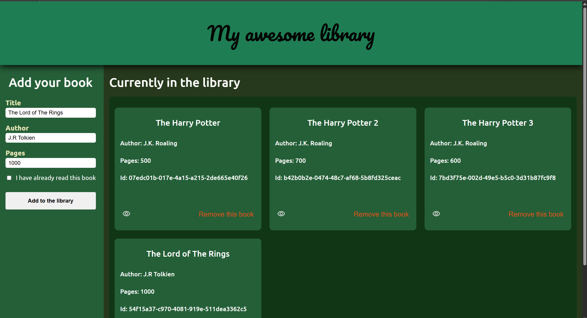

# TOP-Library
**Library** project from [The Odin Project](https://www.theodinproject.com/about) course

## Preview link
https://yurii-ruban.github.io/top-library

## Skills
 - HTML
    * Basic HTML structure
    * Using Material icons
 - CSS
    * Grid layout
    * Flexbox layout
    * Positioning
 - JS
    * Working with `crypto` library
    * Working with `Prototypes`
    * Working with `Object constructors`
    * Working with `DOM`

## Purpose
The **Library** project is the intermediate JS project to be acknowledged and have hands-on experience on JS `Object` creation, state management, working with `prototypes`, etc.
The task is to create a library with possibility of adding/removing new books with their info. Also, regulate `read/unread` states.

## Screenshot

